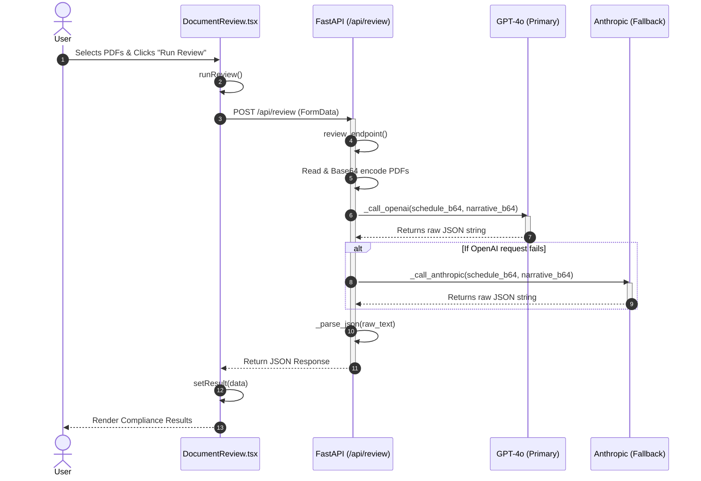

# Document Review API Flow

The `DocumentReview.tsx` component calls the backend `/api/review` endpoint. Here is the complete breakdown of how the PDFs are processed, sent to the backend, analyzed by AI models, and returned to the UI.

## Step-by-Step Function Trace

### 1. Frontend: Initializing the Request
*   **User Action**: The user selects two PDFs (schedule and narrative) and clicks "Run Review".
*   **`runReview()` (DocumentReview.tsx)**: 
    *   Retrieves the selected `scheduleFile` and `narrativeFile`.
    *   Constructs a `FormData` object and appends both files.
    *   Sends an HTTP `POST` request to `${API_BASE}/api/review`.

### 2. Backend: Handling the Endpoint
*   **`review_endpoint()` (backend/app/api/review.py)**:
    *   Receives the `schedule_pdf` and `narrative_pdf` files from the POST request.
    *   Reads the file bytes using `.read()`.
    *   Converts both files' bytes to Base64 encoded strings (`schedule_b64` and `narrative_b64`).

### 3. Backend: AI Analysis Processing
*   **Primary Attempt (`_call_openai()`)**:
    *   Sends the Base64 strings to **OpenAI (GPT-4o)** using the vision/document analysis capabilities.
    *   Passes a strict `_SYSTEM_PROMPT` instructing the model to review the schedule against NJDOT specifications and return a strictly formatted JSON object.
*   **Fallback Attempt (`_call_anthropic()`)**:
    *   If the OpenAI call fails due to a timeout or network error, the backend safely catches the error and falls back to **Anthropic (Claude Sonnet 4)**.
    *   It passes the exact same Base64 strings and system prompt to Claude to get the compliance review JSON.
*   **`_parse_json()`**:
    *   Takes the raw text returned by either AI model and safely parses it into a Python dictionary.
    *   It strips any markdown code blocks (e.g., ` ```json `) to ensure the JSON is valid.

### 4. Resolving and Displaying
*   **`review_endpoint()`**:
    *   Injects the `model_used` (either GPT-4o or Claude) and the static `manual_review_items` list into the JSON payload.
    *   Returns the complete JSON payload back to the frontend.
*   **`runReview()` (Frontend)**:
    *   Receives the JSON response and stores it in the React state via `setResult(data)`.
    *   The UI updates to render the `ReviewResult` cards.

---

## Sequence Diagram


